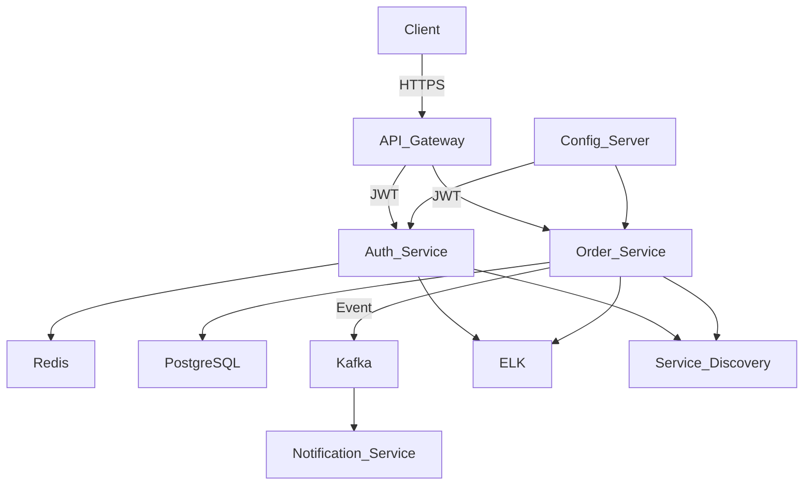

<h1 align="center">
  
</h1>

  
  
  

  ☕ <b>Java Backend / Software Engineer</b>  
  🔹 I specialize in building <b>scalable backend systems</b> and <b>microservices</b> 
  🔹 Strong experience with <b>Java, Spring Boot, REST APIs</b> 
  🔹 Interested in <b>system design & distributed systems</b>  
  🌍 Based in Kazakhstan 🇰🇿 
  🚀 Open to <b>Remote</b> & <b>Relocation</b>

<h2 align="center" style="color:#58A6FF">🛠 Tech Stack</h2>

  

<h2 align="center">📊 GitHub Stats</h2>

 

  

  
  

 

  

 

<!--

Here are some ideas to get you started:

- 🔭 I’m currently working on ...
- 🌱 I’m currently learning ...
- 👯 I’m looking to collaborate on ...
- 🤔 I’m looking for help with ...
- 💬 Ask me about ...
- 📫 How to reach me: ...
- 😄 Pronouns: ...
- ⚡ Fun fact: ...

-->

